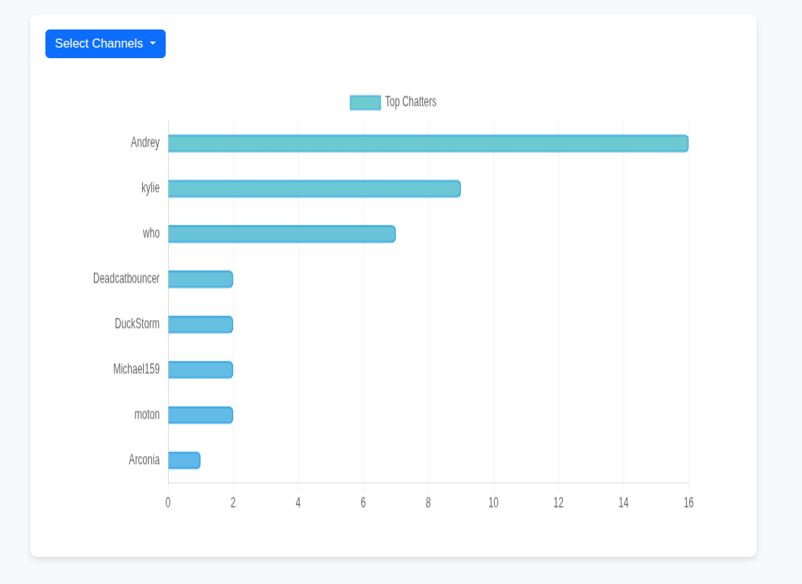

# Monitor Chat Activity on Your Discord Server

**DISCLAIMER** this (a selfbot) is technically against discord policy, so use at your own risk.

## Steps to Deploy
1. Setup a new discord account
2. Log in to the account and connect to the target server
3. Note your discord token (DevTools -> Application -> Local Storage -> Search for Token)
4. Clone into the repo
5. Create a .env file and include TOKEN=<your_token>
6. docker compose up --build (or docker-compose, but be >v2)

